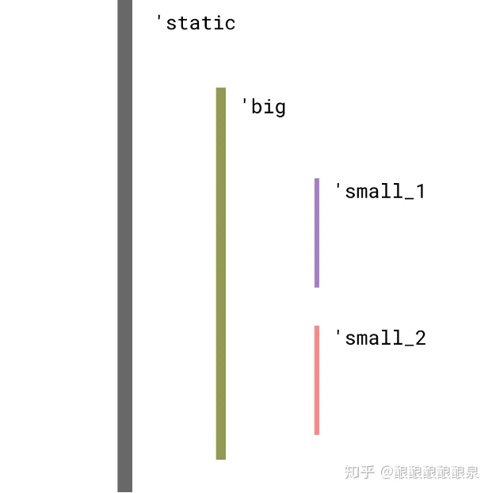

这个项目是在《Rust 圣经》中 2.9.1 中给出的。（https://course.rs/about-book.html）
具体的实现来自https://nomicon.purewhite.io/vec/vec.html

这个项目是关于如何在 Rust 语言中实现一个自定义的向量（`Vec`）结构，类似于标准库中的`Vec<T>`。

# 结构布局和基本概念

1. **指针 (`ptr`)**: 这是一个原始指针，指向分配的内存，用于存储向量的元素。
2. **容量 (`cap`)**: 表示已分配的内存能够容纳多少元素，不一定所有的空间都已被初始化。
3. **长度 (`len`)**: 当前向量中已经初始化的元素数量。

## 原始代码结构

```rust
pub struct Vec<T> {
    ptr: *mut T,
    cap: usize,
    len: usize,
}
```

这个结构可以编译，但是存在一些限制，特别是关于类型变异（variance）和生命周期的处理。在 Rust 中，如果使用裸指针（`*mut T`），编译器会施加严格的类型变异规则。这就导致了如教程中提到的问题，例如`&Vec<&'static str>`不能被用作`&Vec<&'a str>`，这限制了其灵活性和安全性。

### 解释 \*mut T

    *mut T 是Rust中的一个原始指针（raw pointer）类型，区别于Rust的安全引用类型 &T（不可变引用）和 &mut T（可变引用）。
    *mut T 允许指向一个可变的 T 类型的值。使用这种指针，你可以修改它指向的数据，但必须保证这种操作的安全性。
    与普通的引用不同，原始指针不保证指向的内存是有效的，也不会自动管理内存（比如引用计数），并且它们不保证线程安全。
    使用原始指针需要特别注意，因为错误地使用它们很容易导致程序错误，如空指针解引用、野指针（指向无效内存的指针）等问题。

#### 使用场景

在 Rust 中，原始指针主要用于以下几个场景：
与 C 语言接口：当需要与 C 库交互时，原始指针用于与 C 中的指针类型相互转换。
高级内存管理：在实现一些底层数据结构时，比如自定义的内存分配器，链表等，可能需要细粒度控制内存，这时会使用到原始指针。
避开借用检查器：在某些复杂的数据结构或算法中，可能需要绕过 Rust 的借用规则（这通常不推荐，除非你非常清楚自己在做什么）。

## 优化指针处理

为了解决这些问题，Rust 标准库在处理类似的情况时使用了`Unique<T>`。然而，由于`Unique<T>`是不稳定的（即它可能在未来的 Rust 版本中发生改变），所以在稳定版 Rust 中，我们通常会使用`NonNull<T>`替代。`NonNull<T>`是另一种原始指针的包装，它提供了以下特性：

- 协变于`T`。
- 声明指针永远不为空，支持空指针优化。
- 如果`T`是`Send`或`Sync`，则`NonNull<T>`也是。

通过使用`NonNull<T>`，我们可以安全地声明我们的`Vec`结构是协变的，并且确保指针永不为空。

好的，让我们来详细解释这些特性，它们是在 Rust 中使用 `NonNull<T>` 指针时的重要特点。

### 1. 协变于 T

协变（Covariance）是一个类型理论的术语，用于描述类型系统如何相对于它们的参数类型来改变。在 Rust 中，如果一个类型 `X<T>` 在参数 `T` 是协变的，意味着如果你有一个类型 `T` 的子类型 `U`（即 `U` 可以被安全地视为 `T` 的一个特定子集），你可以将 `X<U>` 安全地用作 `X<T>`。

例如，考虑引用和生命周期：如果你有一个生命周期为 `'a` 的引用 `&'a str`，并且 `'a` 是 `'b` 的子生命周期（即 `'a` 比 `'b` 活得更长或相同），那么你可以在期望有生命周期 `'b` 的地方使用生命周期 `'a` 的引用。在这种情况下，引用是协变的。

对于 `NonNull<T>`，它被声明为在 `T` 上是协变的，这意味着如果你有一个类型 `T` 的子类型 `U`，你可以将 `NonNull<U>` 安全地转换为 `NonNull<T>`。这提高了类型的灵活性和通用性，使得使用 `NonNull<T>` 比直接使用裸指针 `*mut T` 更安全、更方便。

关于协变、子类型相关博客：
https://zhuanlan.zhihu.com/p/41814387
https://nomicon.purewhite.io/subtyping.html（英文版：https://doc.rust-lang.org/nomicon/subtyping.html）
《Rust》圣经后续也会讲。
这里理解这个图就好：

这张图的子类型关系应当是 'static: 'big: 'small_1，'static: 'big: 'small_2。而 'static 则是所有 lifetime 的子类型。

### 2. 声明指针永远不为空，支持空指针优化

`NonNull<T>` 是专门设计来表示永远不为 `null` 的原始指针。这种设计保证了在使用这个指针时不需要额外检查 `null`，因为它的类型约束已经确保了这一点。这种非空保证带来了安全性和效率上的提升。

此外，由于 `NonNull<T>` 永远不会是 `null`，它支持所谓的空指针优化（Null Pointer Optimization, NPO）。这意味着当 `NonNull<T>` 被用作某些数据结构的成员时（例如 `Option<NonNull<T>>`），编译器可以使用空指针作为 `Option::None` 的标识，而不需要额外的内存来区分 `None` 和 `Some`。因此，`Option<NonNull<T>>` 的大小与 `NonNull<T>` 一样，无需额外开销。

### 3. 如果 T 是 Send 或 Sync，则 NonNull<T>也是

在 Rust 中，`Send` 和 `Sync` 是两个并发特性标记，它们定义了类型是否可以安全地在线程间传送（`Send`）或共享（`Sync`）。

- **`Send`**: 表示类型的所有权可以从一个线程转移到另一个线程。
- **`Sync`**: 表示类型的不可变引用可以安全地从多个线程同时访问。

`NonNull<T>` 继承了其内部类型 `T` 的这些特性。如果 `T` 是 `Send`，那么 `NonNull<T>` 也是 `Send`，允许它在不同线程之间传递。同样，如果 `T` 是 `Sync`，`NonNull<T>` 也可以安全地在多个线程之间共享。这意味着 `NonNull<T>` 的并发行为直接依赖于 `T` 的特性，使得使用 `NonNull<T>` 时更加灵活和安全。

总结这些特性，`NonNull<T>` 提供了类型系统灵活性、内存安全性、以及并发控制的优势，这使得它在实现底层数据结构时成为一个比裸指针更优越的选择。

### 更新后的代码结构

```rust
use std::ptr::NonNull;

pub struct Vec<T> {
    ptr: NonNull<T>,
    cap: usize,
    len: usize,
}

unsafe impl<T: Send> Send for Vec<T> {}
unsafe impl<T: Sync> Sync for Vec<T> {}
```

在这个结构中，我们使用`NonNull<T>`来替代裸指针。此外，我们还为`Vec<T>`实现了`Send`和`Sync`特质，这意味着如果`T`是`Send`或`Sync`，我们的向量也是，从而允许在多线程环境中安全使用。
